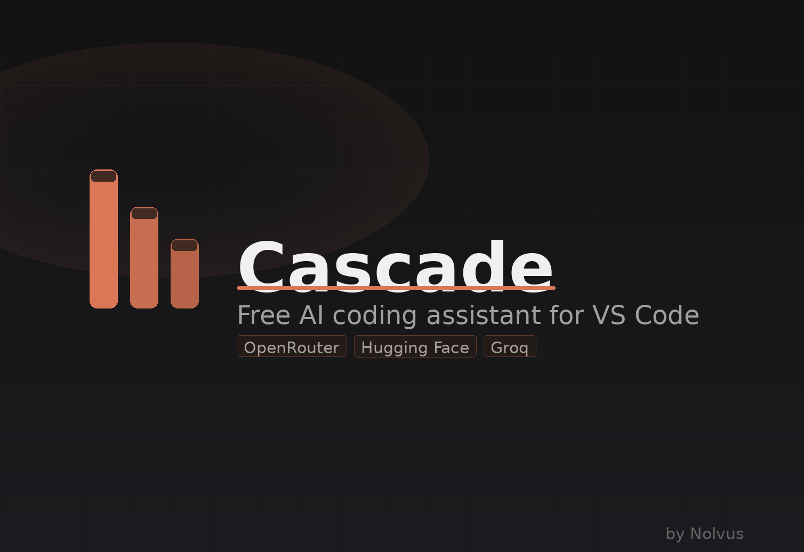

# Cascade — Free AI Coding Assistant for VS Code

> Chat with the best zero-cost AI models right inside VS Code. No subscription, no credit card, no paid plan ever required.

---

## What is Cascade?

Cascade is a lightweight VS Code sidebar extension that connects to three free AI providers — **OpenRouter**, **Hugging Face**, and **Groq** — and lets you chat, ask questions, write code, and work through multi-step problems without spending a penny.

Your API keys are encrypted in VS Code's built-in Secret Storage and never touch any third-party server. Nothing leaves your machine except the messages you send to your chosen AI provider.

---

## Features

| Feature | Details |
|---|---|
| **Free models** | Llama 3.3 70B, DeepSeek R1, Gemma 3, Qwen 3, Mistral 7B, and more |
| **Three providers** | OpenRouter · Hugging Face · Groq — switch any time |
| **Progress panel** | Multi-step tasks show a live progress tracker with step checkmarks |
| **Session history** | Persistent chat sessions survive VS Code restarts; search and restore any session |
| **File context** | Attach the active file, open editors, any workspace file, or your Problems list |
| **Code actions** | Copy, Apply to File, and Run in Terminal buttons on every code block |
| **Secure key storage** | Keys stored in VS Code Secret Storage — never in settings.json or git |
| **Full settings panel** | Temperature, max tokens, top-p, context depth, approval mode, file & terminal access |

---

## Installation

### From VSIX (recommended while unlisted)

1. Download `NolvusMadeIt.cascade-1.0.0.vsix` from the [Releases](../../releases) page.
2. In VS Code open the Command Palette (`Ctrl+Shift+P`) and run **Extensions: Install from VSIX…**
3. Select the downloaded file and reload when prompted.

### From Marketplace *(coming soon)*

Search **Cascade** in the Extensions sidebar or visit the VS Code Marketplace page.

---

## Quick Start

1. Click the **Cascade** icon in the VS Code Activity Bar.
2. Click **⚙ Settings** → **API Keys**.
3. Paste your free API key for any provider (see links below).
4. Click **Save** — the model list loads automatically.
5. Start chatting!

### Get a free API key

| Provider | Sign-up link | Key format |
|---|---|---|
| OpenRouter | [openrouter.ai/keys](https://openrouter.ai/keys) | `sk-or-…` |
| Hugging Face | [huggingface.co/settings/tokens](https://huggingface.co/settings/tokens) | `hf_…` |
| Groq | [console.groq.com/keys](https://console.groq.com/keys) | `gsk_…` |

---

## Providers & Models

### OpenRouter (recommended)
Access to dozens of free-tier models from a single key. Cascade filters to `$0/token` models by default. Toggle **Free models only** off in Settings → Models to see all available models.

Highlights: Llama 3.3 70B · DeepSeek R1 · DeepSeek Chat V3 · Gemma 3 27B · Qwen 3 30B · Phi-4 Reasoning

### Hugging Face
Direct access to the Hugging Face Inference API. Best for open-weight research models.

Highlights: Qwen 2.5 Coder 32B · Llama 3.3 70B · DeepSeek R1 · Gemma 3 27B

### Groq
Blazing-fast inference on Groq's LPU hardware. Lowest latency of the three.

Highlights: Llama 3.3 70B Versatile · DeepSeek R1 Distill · Gemma 2 9B · Mixtral 8x7B

---

## Settings

Open **⚙ Settings** from the Cascade sidebar header.

| Section | Key options |
|---|---|
| **API Keys** | Add/update/clear keys per provider |
| **Models** | Free-only toggle, fallback provider |
| **Sampling** | Temperature, max tokens, top-p, chat history depth |
| **Workspace** | File access (off/read/read+write), file scope, terminal access, git operations, approval mode |
| **Profile** | Your name (Cascade addresses you personally), custom system prompt |
| **Privacy** | Chat history retention (unlimited/30d/7d/off), clear all history |

---

## Contributing

See [CONTRIB.md](CONTRIB.md) for full setup instructions, project structure, and PR guidelines.

---

## About

See [ABOUT.md](ABOUT.md) for the motivation behind Cascade, the roadmap, and credits.

---

## License

MIT — see [LICENSE](LICENSE) for details.

---

*Built with ❤ by [NolvusMadeIt](https://github.com/NolvusMadeIt)*
